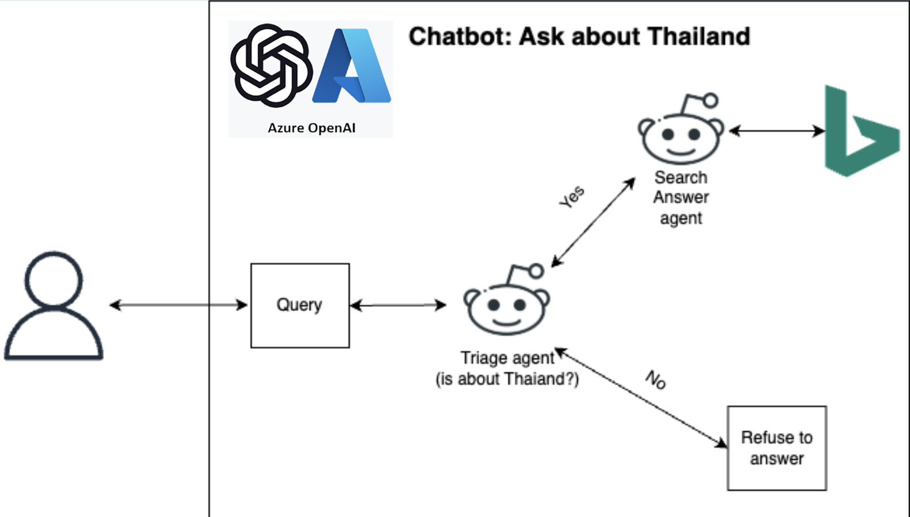
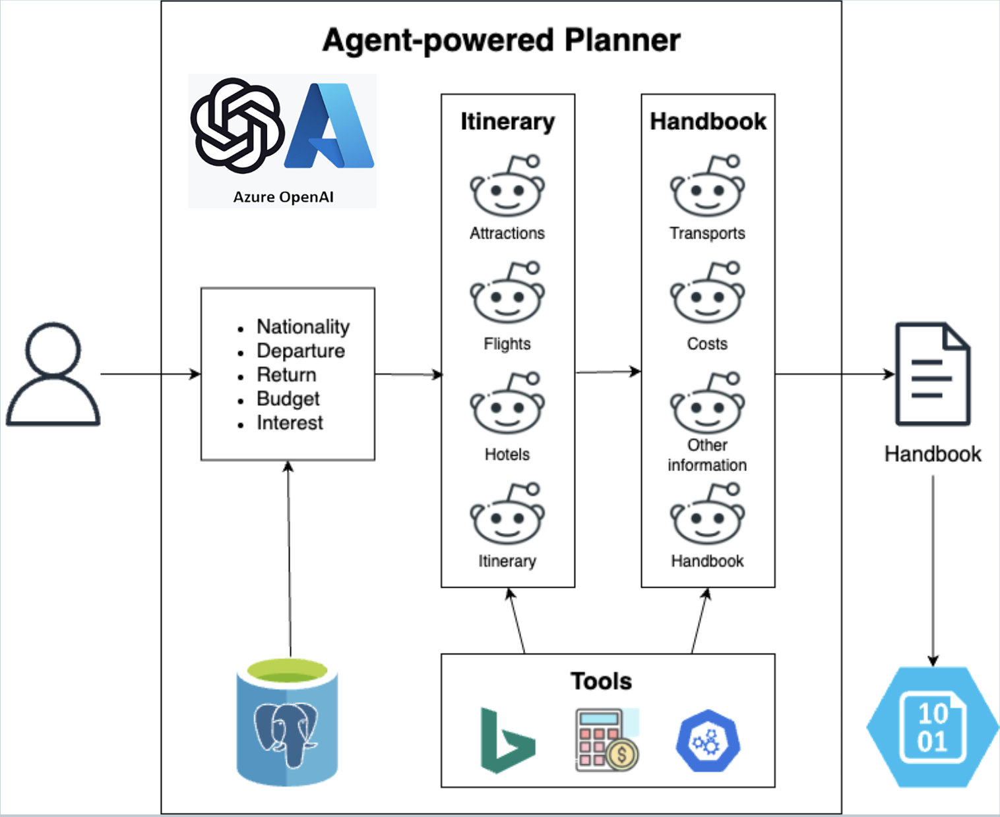

# Thailand Trip Companion

**Your Intelligent Guide to Thailand**

Thailand Trip Companion is an AI-powered travel assistant designed to make exploring Thailand safer, easier, and more personalized. Built using Python, Azure OpenAI, CrewAI, and more Azure Services, this application enables travelers to plan their trips effortlessly while overcoming language barriers and accessing up-to-date travel information.

---

## Why Thailand Trip Companion?

Thailand has faced tourism challenges such as natural disasters impacting tourist confidence and language barriers limiting exploration beyond popular cities. Our solution bridges these gaps by providing tourists with a smart, multilingual guide that ensures safety, convenience, and unforgettable travel experiences.

---

## Key Features

- **Chatbot**
  - Ask questions about Thailand's culture, attractions, customs, safety protocols, and more.
  - Powered by Azure OpenAI for accurate and engaging responses.

- **AI-Powered Travel Planner**
  - Generates a complete day-by-day itinerary.
  - Google Hotel Search API, Bing Search API, Azure OpenAI for real-time, reliable data.
  - Suggests attractions, hotels, internal transportation, and weather forecasts.
  - Produces a beautifully formatted HTML travel handbook.

- **Feedback System**
  - Collects traveler feedback to continuously improve the system.

---

## Architecture Overview on Each Section

### Agent Chatbot

- User sends a query through the Streamlit interface.
- Query is passed to the Triage Agent, which is an LLM-driven agent determining if the query is related to Thailand.
- Conditional flow based on triage decision:
    - If the question is about Thailand:
        - The Triage Agent passes the query to the Search Answer Agent.
        - This agent uses the Azure Bing Search API to retrieve up-to-date information.
        - The LLM summarizes and returns the most relevant answer to the user.
    - If the question is not about Thailand:
        - The Triage Agent instructs the system to refuse to answer.
        - This ensures the chatbot stays focused and avoids hallucinations.
- The final response is returned to the user via the interface.

**Key Design Principles**
- Focused context: Limits answers to Thailand-related topics for accuracy and alignment.
- Agent-based design: Clear separation of responsibilities (classification vs. answering).
- Real-time search: Leverages Bing API for fresh, factual responses.
- Guardrails built-in: Refuses off-topic questions to improve trust and relevance.

### Agent-powered Solo Travel Planner

- User provides key travel inputs:
    - Nationality, departure location, return date, budget, and personal interests
    - This is either entered manually or loaded from saved user data (e.g., from a PostgreSQL database)
- Itinerary Generation Agents:
    - **Attractions Agent:** selects suitable tourist spots based on interest, time, and geography
    - **Flights Agent:** finds suitable outbound and return flights using Bing Search or flight APIs
    - **Hotels Agent:** identifies hotels based on location, price, and trip schedule using Google Hotel Search API
    - **Itinerary Agent:** compiles all the above into a coherent, day-by-day travel schedule
- Handbook Generation Agents:
    - **Transport Agent:** suggests transportation options between places (with time and cost)
    - **Cost Agent:** summarizes estimated expenses (flights, hotel, transport)
    - **Other Info Agent:** adds currency exchange, weather forecast, emergency info, Thai phrases, travel tips
    - **Handbook Agent:** combines everything into a structured, formatted HTML handbook
- Tools Used (by various agents):
    - Azure OpenAI (LLMs)
    - Azure Bing Search API (for real-time info)
    - Serp Google Hotels Search API
	- Serp Google Flights Search API
- Output:
    - The final result is an HTML handbook containing all travel info, structured and styled for ease of use.

**Key Design Principles**
- Modular agent design: Each agent handles a focused task (attractions, flights, etc.), ensuring clarity.
- Pipeline execution: Outputs from one agent (e.g., flight or attraction) feed into the next (itinerary, handbook), allowing dynamic, context-aware planning.
- Real-world APIs: Uses real data (e.g., hotels, weather, exchange rates) for high accuracy and practical use.
- Separation of logic and presentation: Logic agents generate content, while the Handbook Agent formats it for display.
- Scalable and extendable: New agents (e.g., local events, restaurant suggestions) can be added easily.

### Feedback

- User submits feedback through the app (Streamlit interface).
    - This can include ratings, comments, bug reports, or suggestions for improvement.
	- submit directly to a container Azure Blob Storage for analysis.

---

## Architecture Overview on Azure

- The application, built using Streamlit and CrewAI, is packaged into a Docker container and pushed to Azure Container Registry.
- Azure App Service pulls the container from the registry and hosts the web interface accessible by end users.
- The app securely connects to a PostgreSQL database hosted on Azure Database for PostgreSQL via a Virtual Network with separate subnets for compute and storage.
- Azure Key Vault is used to manage sensitive credentials such as API keys and database passwords.
- Azure Blob Storage is used to persist user-generated artifacts like HTML handbooks and feedback data.

---

## Impact

- Mitigating the risk of declining tourism
- Restoring confidence
- Reducing the language barrier
- Improving the tourist experience
- Centralizing for convenience

---

## Future Improvements

- Chatbot
    - More agents and manager for specific questions
    - More guardrails
- Planner
    - More stable result
    - More flexibility
    - Able to choose flights and hotels by either user or AI
    - Show image and map of places
- Others
    - User Access Control
    - Better UX/UI
- More ...

---

## Acknowledgement

This repository was created for submission to the [Microsoft AI Agents Hackathon](https://microsoft.github.io/AI_Agents_Hackathon/).
It showcases how Python, CrewAI, Azure services, and multi-agent orchestration can deliver smart, user-focused travel experiences.
